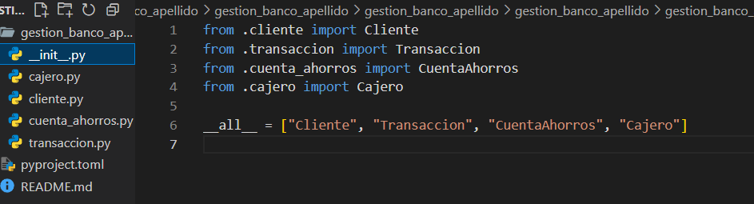

Proyecto final



# gestion_banco_apellido

Paquete educativo para la gestión de clientes, cuentas de ahorros y transacciones bancarias usando **Programación Orientada a Objetos (POO) en Python**.

> 🔁 **Importante:** Reemplaza `apellido` por tu apellido real en el nombre del paquete, por ejemplo: `gestion_banco_nicolalde`.

---

## 📦 Instalación (desde PyPI)

```bash
pip install gestion_banco_apellido
#en la imagen se detalla la estructura de como esta hecha la estructura